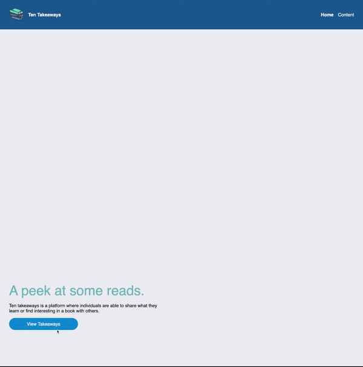

# Ten Takeaways

## Description

Ten Takeaways is an app used to log my progression and book reading as I go through the year. This application can be used by me, my friends, or anyone with a computer.

See the app [here](https://book-summaries.vercel.app/). **Note:** Backend communication has been turned off given resource cost, local loading used instead.

## Demo

## Stack

Frontend: React, ChakraUI

Backend: Express/Node

Database: Postgresql